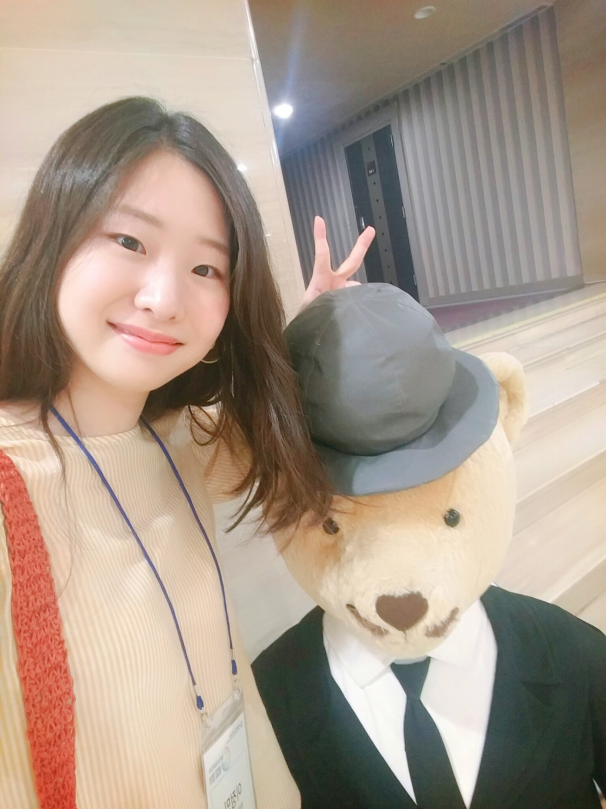

<!-- One -->
<section id="one">
	

		

<h2>Jeongmin Lee</h2>

B.S in Computer Science, Hanyang University, Seoul, Korea, Feb.2020 
Room 111, R&D Building 
e-mail: j0064423@hanyang.ac.kr

<a target="_blank" rel="noopener noreferrer" href="http://cs.hanyang.ac.kr/">Department Of Computer Science</a>
 
<a target="_blank" rel="noopener noreferrer" href="https://www.hanyang.ac.kr/">Hanyang University</a>

	

</section>

## Research Interests
Physically-Based Character Control

## Publications
<a target="_black" rel="noopener noreferrer" href="https://doi.org/10.15701/kcgs.2020.26.4.1">심층 강화 학습을이용한 Luxo 캐릭터의 제어</a>
