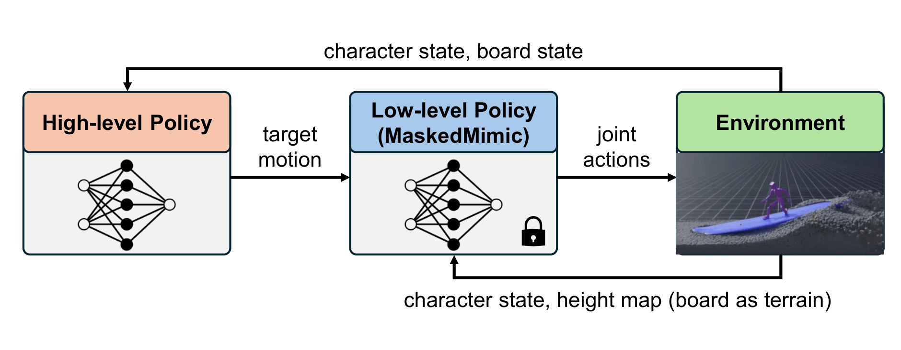

    SIGGRAPH 2026 Posters

	<a href="../people/hauk-nam.html">Hauk Nam*</a>
	<a href="../people/changho-lee.html">Changho Lee*</a>
	<a href="../people/yoonsang-lee.html">Yoonsang Lee</a>

 
    Hanyang University

 
	* Co-first authors

  <a href="https://dl.acm.org/doi/abs/10.1145/3799825.3818707" rel="noopener noreferrer" target="_blank" class="button icon">
    
    Publisher
  </a>

  <a href="https://gitcgr.hanyang.ac.kr/publications/2026-learning-surfing-like/learning-surfing-like-poster.pdf" rel="noopener noreferrer" target="_blank" class="button icon">
    
    Poster
  </a>

  
*Our method learns surfing-like balance control without water simulation. The learned policy maintains stable balance on a moving board under wave conditions at runtime.*

## Video 

 

<iframe width="730" height="411" src="https://www.youtube.com/embed/Vf1hafwHSmM" title="Learning Surfing-like Balance without Water Simulation" frameborder="0" allow="accelerometer; autoplay; clipboard-write; encrypted-media; gyroscope; picture-in-picture; web-share" referrerpolicy="strict-origin-when-cross-origin" allowfullscreen></iframe>

  
 

## Abstract
Controlling characters in fluid environments such as water remains challenging due to complex dynamics and high simulation cost. In particular, surfing requires maintaining balance on a continuously moving support, making stable control difficult without accurate physical modeling. In this work, we present a method for learning surfing-like balance control without relying on water simulation. Our approach combines a hierarchical control framework with a stage-based training scheme that progressively introduces dynamic board behavior. The low-level policy generates full-body motion from partial joint targets, while the high-level policy adapts these targets based on environmental conditions.
Despite being trained entirely in a non-fluid setting, the learned policy maintains stable balance on a moving board under wave conditions at runtime. These results suggest that surfing-like balance can be achieved without explicitly modeling fluid dynamics through appropriate control structures and training strategies.

## Method Overview

Our framework is composed of a low-level policy and a high-level policy. The low-level policy is a pretrained [MaskedMimic](https://research.nvidia.com/labs/par/maskedmimic/) model that tracks target motions defined on six key joints (root, head, hands, feet) to produce full-body motion, without requiring task-specific reference motions. The high-level policy observes the character and board states and predicts residual offsets on top of a predefined surfing pose, adapting the tracked targets to the board's movement. This separation lets the low-level policy focus on stable full-body motion while the high-level policy handles adaptation to the dynamic environment.

## Training Objective
The high-level policy is trained with the following reward:

<em>r = w1rboard + w2rcontact + w3rstability + w4rfoot + w5rhead + w6rsmooth</em>

combining terms for board stability, foot contact/slipping, foot placement, head orientation, and motion smoothness. To avoid relying on water simulation, we introduce dynamic board behavior gradually through a stage-based curriculum: Stage 1 trains balance on a board suspended in the air with only pitch stabilized, exposing the policy to lateral (roll) instability; Stage 2 adds forward motion and a gradually increasing target pitch, producing coupled translational and rotational dynamics that resemble surfing. Under forward motion and time-varying board pitch, adding Stage 2 raises the success rate from 15% to 60% over Stage-1-only training, and despite never being trained in water, the resulting policy also generalizes to maintain balance under wave conditions at runtime.

## Paper & Poster
Publisher: [page](https://dl.acm.org/doi/abs/10.1145/3799825.3818707), [paper](https://dl.acm.org/doi/pdf/10.1145/3799825.3818707) \
Preprint: [paper](https://gitcgr.hanyang.ac.kr/publications/2026-learning-surfing-like/learning-surfing-like-preprint.pdf) \
[Poster](https://gitcgr.hanyang.ac.kr/publications/2026-learning-surfing-like/learning-surfing-like-poster.pdf)