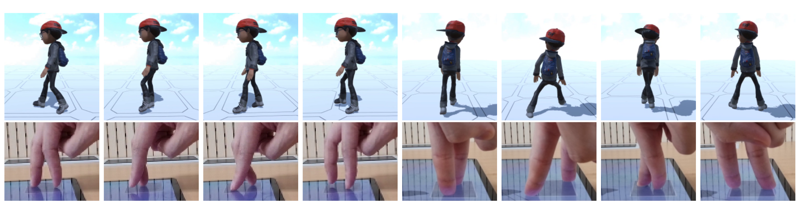

    TVCG (2026)

	<a href="../people/jiwon-yi.html">Jiwon Yi</a>
	<a href="../people/yoonsang-lee.html">Yoonsang Lee</a>

 
    
Hanyang University

  <a href="https://ieeexplore.ieee.org/document/11519541" rel="noopener noreferrer" target="_blank" class="button icon">
    
    Publisher
  </a>

  <!--<a href="https://arxiv.org/abs/2511.07860" rel="noopener noreferrer" target="_blank" class="button icon">-->
    <!---->
    <!--arXiv-->
  <!--</a>-->

  <!--<a href="https://gitcgr.hanyang.ac.kr/publications/2025-touchwalker/touchwalker-ismar-presentation.pdf" rel="noopener noreferrer" target="_blank" class="button icon">-->
    <!---->
    <!--Slides (PDF)-->
  <!--</a>-->

  <!--<a href="https://gitcgr.hanyang.ac.kr/publications/2025-touchwalker/touchwalker-ismar-presentation.pptx" rel="noopener noreferrer" target="_blank" class="button icon">-->
    <!---->
    <!--Slides (PPTX)-->
  <!--</a>-->

<!--  -->
<!--*TouchWalker enables real-time control of full-body avatar locomotion using finger walking on a touchscreen. Users specify foot contacts within a touch region overlaid on the screen (bottom), and the system generates responsive full-body locomotion (top).*-->

<!--## Video -->
<!--
 
-->
<!--<iframe width="640" height="360" src="https://www.youtube.com/embed/RO8SRQUstoI" title="TouchWalker: Real-Time Avatar Locomotion from Touchscreen Finger Walking" frameborder="0" allow="accelerometer; autoplay; clipboard-write; encrypted-media; gyroscope; picture-in-picture; web-share" referrerpolicy="strict-origin-when-cross-origin" allowfullscreen></iframe>-->
<!--

  -->
<!-- -->

## Abstract
Authoring high-quality character animation is essential in multimedia production, especially for pre-rendered formats such as films and TV series. These workflows are often iterative, requiring frequent adjustments and immediate visual feedback, and typically involve editing existing motion, such as mocap data. We present Neural Motion Path (NMP), a deep learning-based system designed to support this authoring process by enabling full-body motion editing through joint-level motion path manipulation. While joint rotations are essential for expressive human motion, explicitly specifying them imposes a significant burden on users; NMP addresses this challenge by enabling intuitive position-only motion path editing while implicitly inferring plausible rotation trajectories. To address the inherent tension between motion plausibility and precise constraint satisfaction, NMP explicitly decouples motion synthesis from constraint enforcement within an autoregressive framework. NMP generates realistic, context-aware motion without fine-tuning every path detail, making it accessible to novices while supporting the demands of detailed animation authoring. It combines a motion generator with a novel RotationNet for inferring joint rotation, and a constraint imposer that enforces end-effector constraints via an Explicit-Weight Sparse Expert Model (EW-SEM). The system supports terrain adaptation and authoring operations like Concatenate, Insert, and Mix. Implemented as a Blender add-on, NMP supports real-time playback and interactive workflows. A user study with novice users shows that NMP improves satisfaction, efficiency, and perceived motion quality compared to the conventional layered keyframing approach, highlighting its potential as an accessible and effective authoring tool.

## Paper
Publisher: [page](https://ieeexplore.ieee.org/document/11519541)
\
<!--arXiv: [page](https://arxiv.org/abs/2511.07860), [paper](https://arxiv.org/pdf/2511.07860)-->

<!--## Presentation-->
<!--ISMAR 2025 Presentation Slides: [pdf](https://gitcgr.hanyang.ac.kr/publications/2025-touchwalker/touchwalker-ismar-presentation.pdf) (2MB), [pptx](https://gitcgr.hanyang.ac.kr/publications/2025-touchwalker/touchwalker-ismar-presentation.pptx) (268.8MB)-->

