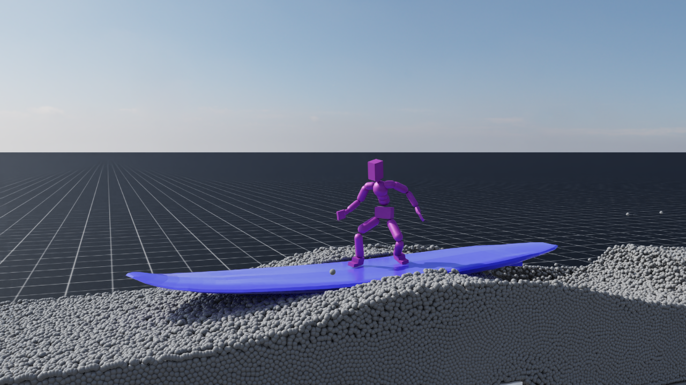

    SIGGRAPH 2026 Posters

	<a href="../people/hauk-nam.html">Hauk Nam*</a>
	<a href="../people/changho-lee.html">Changho Lee*</a>
	<a href="../people/yoonsang-lee.html">Yoonsang Lee</a>

 
    
Hanyang University

 
	* Co-first authors

  <!--<a href="https://ieeexplore.ieee.org/document/11519541" rel="noopener noreferrer" target="_blank" class="button icon">-->
    <!---->
    <!--Publisher-->
  <!--</a>-->

  <!--<a href="https://arxiv.org/abs/2511.07860" rel="noopener noreferrer" target="_blank" class="button icon">-->
    <!---->
    <!--arXiv-->
  <!--</a>-->

  <!--<a href="https://gitcgr.hanyang.ac.kr/publications/2025-touchwalker/touchwalker-ismar-presentation.pdf" rel="noopener noreferrer" target="_blank" class="button icon">-->
    <!---->
    <!--Slides (PDF)-->
  <!--</a>-->

  <!--<a href="https://gitcgr.hanyang.ac.kr/publications/2025-touchwalker/touchwalker-ismar-presentation.pptx" rel="noopener noreferrer" target="_blank" class="button icon">-->
    <!---->
    <!--Slides (PPTX)-->
  <!--</a>-->

  
*Our method learns surfing-like balance control without water simulation. The learned policy maintains stable balance on a moving board under wave conditions at runtime.*

## Video 

 

<iframe width="730" height="411" src="https://www.youtube.com/embed/Vf1hafwHSmM" title="Learning Surfing-like Balance without Water Simulation" frameborder="0" allow="accelerometer; autoplay; clipboard-write; encrypted-media; gyroscope; picture-in-picture; web-share" referrerpolicy="strict-origin-when-cross-origin" allowfullscreen></iframe>

  
 

## Abstract
Controlling characters in fluid environments such as water remains challenging due to complex dynamics and high simulation cost. In particular, surfing requires maintaining balance on a continuously moving support, making stable control difficult without accurate physical modeling. In this work, we present a method for learning surfing-like balance control without relying on water simulation. Our approach combines a hierarchical control framework with a stage-based training scheme that progressively introduces dynamic board behavior. The low-level policy generates full-body motion from partial joint targets, while the high-level policy adapts these targets based on environmental conditions.
Despite being trained entirely in a non-fluid setting, the learned policy maintains stable balance on a moving board under wave conditions at runtime. These results suggest that surfing-like balance can be achieved without explicitly modeling fluid dynamics through appropriate control structures and training strategies.

<!--## Paper-->
<!--Publisher: [page](https://ieeexplore.ieee.org/document/11519541)-->
<!--\-->
<!--arXiv: [page](https://arxiv.org/abs/2511.07860), [paper](https://arxiv.org/pdf/2511.07860)-->

<!--## Presentation-->
<!--ISMAR 2025 Presentation Slides: [pdf](https://gitcgr.hanyang.ac.kr/publications/2025-touchwalker/touchwalker-ismar-presentation.pdf) (2MB), [pptx](https://gitcgr.hanyang.ac.kr/publications/2025-touchwalker/touchwalker-ismar-presentation.pptx) (268.8MB)-->

